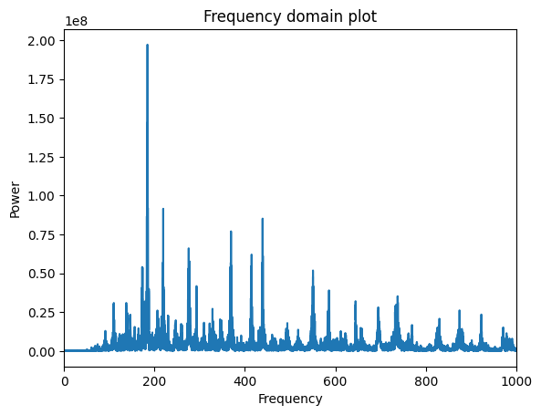

# MATH 260 Final Project: Fourier Transform and Audio

## Introduction

My final project focused on using scipy's `fft` module to apply the Fast Fourier Transform to audio signals. Using the FFT, I generated frequency-domain plots of audio signals and applied simple low-pass, high-pass, and band-pass filters to audio signals. I also used the inverse FFT functions to translate the transformed frequency-domain data into new audio files in order to listen to the effects of the various filters. Finally, I applied a low-pass filter to a section of a piece of music in order to isolate the lower voice. All of my code is included in `fft_filter.py`.

## Applying the FFT

The first step was to apply the FFT to audio signals. I used the scipy's built-in `fft.rfft` function, which is designed to apply the FFT to real-valued signals. The accompanying `fft.rfftfreq` function outputs a list containing the centers of the frequency bins created by `rfft`, which makes applying transformations much easier. To test these functions, I applied the FFT to `audioSample.wav`, which is a short audio segment from the end of a solo piano piece (Mendelssohn Op. 28). First, I had to convert the audio signal into a 16-bit WAV file with a sample rate of 44.1 kHz using an external audio editor. I then read the file into Python using `scipy.io.wavfile.read`. Before applying the FFT, I converted the stereo signal into a mono signal by averaging the two stereo channels. I then applied the FFT to the mono signal, and used the result to generate a frequency domain plot:

I also generated a more readable version with the high frequencies omitted:

## Filters

I then proceeded to apply filters to the transformed signal.

### Low-pass filter

The low-pass filter was the first filter I implemented. My first attempt at writing a LP filter, `naiveLP`, used a step function as the frequency response function: I set the power of all frequencies in bins whose centers were above the cutoff frequency to 0, while leaving all other frequencies' powers intact. The frequency-domain plot of the transformed signal showed the sharp cutoff at 440 Hz:

The effect of the low-pass filter is clearly audible in the transformed audio signal (`LPsignal1.wav`). However, we can clearly hear that the filter introduced an artifact—a buzz at about 440 Hz that lingers at the end of the audio file and which was not present in the original signal. This is perhaps a consequence of the Gibbs phenomenon, given that the frequency response function used was a step function. 

To address this issue, I wrote a second low-pass filter, this time using a sigmoid curve as the frequency response function. I applied the LP filter given by the frequency response function

to `audioSample.wav`, and generated the corresponding frequency-domain plot of the result:

The resulting audio file (`LPsignal2.wav`) sounds similar to the result of the step-function LP filter, except with no buzz at 440 Hz. The result sounds very muted and "flat" compared to the original, likely because the low-pass filter eliminates most of the notes' overtones, which are a large part of what makes the piano sound like a piano.

### High-pass filter

Using a similar technique, I wrote a sigmoid-based high-pass filter (`HP`). After applying this filter to `audioSample.wav`, I generated the frequency-domain plot:

The effects of the HP filter are clearly audible in the corresponding audio file (`HPsignal.wav`). However, it sounds as if there are still lower frequencies present in the audio file, even though the frequency-domain plot shows that no frequencies below 400 Hz are present in the signal. This may be an example of the missing fundamental phenomenon: since the high-pass filter leaves intact many of the overtones of the notes whose fundamental frequencies it eliminates, it can sound as if we "hear" the fundamental frequency even though it is not actually present in the signal. The overtones of the lower notes were likely quite prominent in this audio sample, since it was played with the piano's damper pedal depressed (allowing all of the strings to vibrate freely), and many of the overtones of the lower notes were actually played. 

### Band-pass filter

I implemented a band-pass filter using a combination of the sigmoid functions from the low-pass and high-pass filters. Specifically, I applied the filter given by the frequency response function

to `audioSample.wav` and generated the frequency-domain plot:

The corresponding audio file (`BPsignal.wav`) makes the effect of the filter clear; both the "flattened" sound of the LP filter and the missing fundamental phenomenon of the HP filter are audible. 

## Separating Instruments

To test the LP filter on another audio sample, I took an excerpt from a piece (Shostakovich Piano Quintet Op. 57, 5th movement) where the piano is playing much lower than the strings. The frequency-domain plot of the original signal (`audioSample2.wav`) showed a wide range of frequencies present:

In this excerpt, the piano is playing below middle C and the strings are playing well above middle C, so I set the cutoff of the LP filter at 262 Hz. The resulting frequency-domain plot confirms that the filter worked as expected:

The resulting audio file, `separatedSignal.wav`, has no traces of the strings. The piano part sounds "flattened," as expected. And it seems that some very low-frequency noise was amplified when the transformed signal was normalized to use the full range of the 16-bit sample depth. Nonetheless, the filter was certainly effective in eliminating the strings and separating out the piano part.